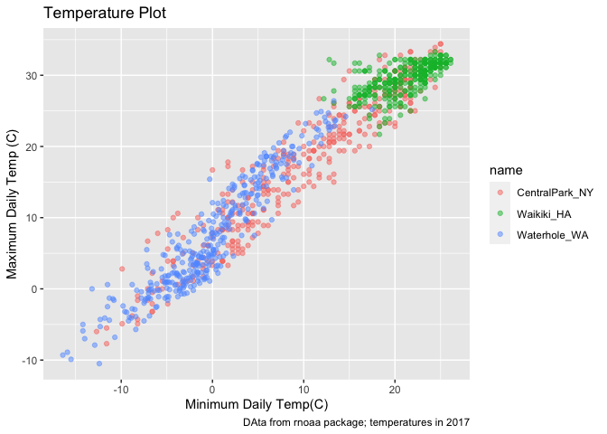
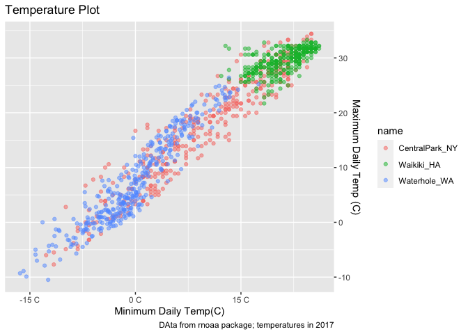
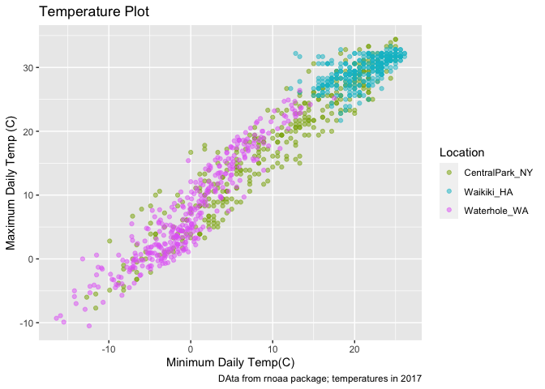
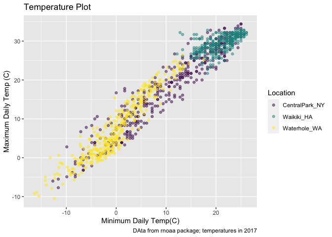
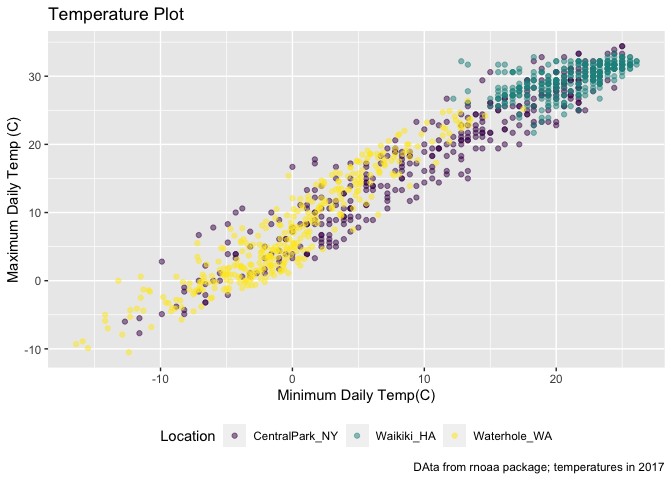
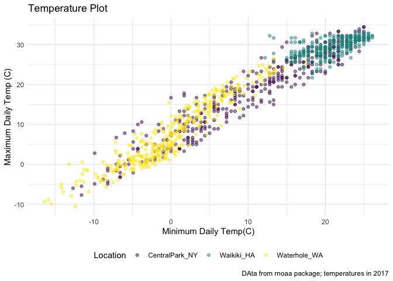
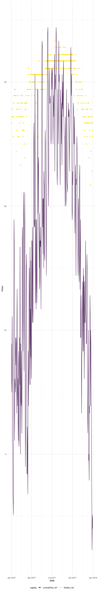
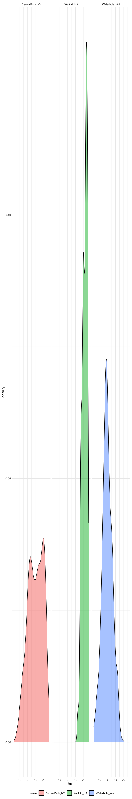
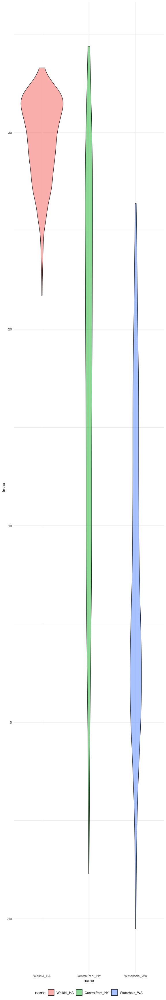

Visualizations
================

``` r
library(tidyverse)
```

    ## ── Attaching packages ─────────────────────────────── tidyverse 1.3.0 ──

    ## ✓ ggplot2 3.3.2     ✓ purrr   0.3.4
    ## ✓ tibble  3.0.3     ✓ dplyr   1.0.2
    ## ✓ tidyr   1.1.2     ✓ stringr 1.4.0
    ## ✓ readr   1.3.1     ✓ forcats 0.5.0

    ## ── Conflicts ────────────────────────────────── tidyverse_conflicts() ──
    ## x dplyr::filter() masks stats::filter()
    ## x dplyr::lag()    masks stats::lag()

``` r
library(ggridges)
```

``` r
weather_df = 
  rnoaa::meteo_pull_monitors( 
    c("USW00094728", "USC00519397", "USS0023B17S"), 
    var = c("PRCP", "TMIN", "TMAX"), 
    date_min = "2017-01-01",
    date_max = "2017-12-31") %>%
#rnoaa package allows you to pull public data from online. 
#want data drom these three weather stations
    mutate(
    name = recode(
      id, 
      USW00094728 = "CentralPark_NY", 
      USC00519397 = "Waikiki_HA",
      USS0023B17S = "Waterhole_WA"),
    tmin = tmin / 10,
    tmax = tmax / 10) %>%
  #the degrees that come from rnoaa are in a 10ths of a deg C. 
  select(name, id, everything())
```

    ## Registered S3 method overwritten by 'hoardr':
    ##   method           from
    ##   print.cache_info httr

    ## using cached file: /Users/madhusudhanpatel/Library/Caches/R/noaa_ghcnd/USW00094728.dly

    ## date created (size, mb): 2020-10-05 13:38:35 (7.522)

    ## file min/max dates: 1869-01-01 / 2020-10-31

    ## using cached file: /Users/madhusudhanpatel/Library/Caches/R/noaa_ghcnd/USC00519397.dly

    ## date created (size, mb): 2020-10-05 13:38:42 (1.699)

    ## file min/max dates: 1965-01-01 / 2020-03-31

    ## using cached file: /Users/madhusudhanpatel/Library/Caches/R/noaa_ghcnd/USS0023B17S.dly

    ## date created (size, mb): 2020-10-05 13:38:44 (0.88)

    ## file min/max dates: 1999-09-01 / 2020-10-31

``` r
weather_df
```

    ## # A tibble: 1,095 x 6
    ##    name           id          date        prcp  tmax  tmin
    ##    <chr>          <chr>       <date>     <dbl> <dbl> <dbl>
    ##  1 CentralPark_NY USW00094728 2017-01-01     0   8.9   4.4
    ##  2 CentralPark_NY USW00094728 2017-01-02    53   5     2.8
    ##  3 CentralPark_NY USW00094728 2017-01-03   147   6.1   3.9
    ##  4 CentralPark_NY USW00094728 2017-01-04     0  11.1   1.1
    ##  5 CentralPark_NY USW00094728 2017-01-05     0   1.1  -2.7
    ##  6 CentralPark_NY USW00094728 2017-01-06    13   0.6  -3.8
    ##  7 CentralPark_NY USW00094728 2017-01-07    81  -3.2  -6.6
    ##  8 CentralPark_NY USW00094728 2017-01-08     0  -3.8  -8.8
    ##  9 CentralPark_NY USW00094728 2017-01-09     0  -4.9  -9.9
    ## 10 CentralPark_NY USW00094728 2017-01-10     0   7.8  -6  
    ## # … with 1,085 more rows

## Remember this plot

``` r
weather_df %>% 
  ggplot(aes(x = tmin, y = tmax, color = name)) +
  geom_point(alpha = 0.5) + 
  labs(
    title = "Temperature Plot",
    x = "Minimum Daily Temp(C)",
    y = "Maximum Daily Temp (C)",
    caption = "DAta from rnoaa package; temperatures in 2017"
  ) 
```

    ## Warning: Removed 15 rows containing missing values (geom_point).

<!-- -->

## Scales

Start with the same plot; x and y are scales

``` r
weather_df %>% 
  ggplot(aes(x = tmin, y = tmax, color = name)) +
  geom_point(alpha = 0.5) + 
  labs(
    title = "Temperature Plot",
    x = "Minimum Daily Temp(C)",
    y = "Maximum Daily Temp (C)",
    caption = "DAta from rnoaa package; temperatures in 2017"
  ) +
  scale_x_continuous(
    breaks = c(-15, 0, 15),
    labels = c("-15 C", "0 C", "15 C")
  ) +
  scale_y_continuous(
   # trans = "sqrt" + #does a squarert transformation, "log" transformation.  
    position = "right" #will move the labels to the right side.
  )
```

    ## Warning: Removed 15 rows containing missing values (geom_point).

<!-- -->

Look at color scales

``` r
weather_df %>% 
  ggplot(aes(x = tmin, y = tmax, color = name)) +
  geom_point(alpha = 0.5) + 
  labs(
    title = "Temperature Plot",
    x = "Minimum Daily Temp(C)",
    y = "Maximum Daily Temp (C)",
    caption = "DAta from rnoaa package; temperatures in 2017"
  ) +
  scale_color_hue(
    name = "Location", #name here is the fn not the name "name"
    h = c(100, 300)
      )
```

    ## Warning: Removed 15 rows containing missing values (geom_point).

<!-- -->

``` r
weather_df %>% 
  ggplot(aes(x = tmin, y = tmax, color = name)) +
  geom_point(alpha = 0.5) + 
  labs(
    title = "Temperature Plot",
    x = "Minimum Daily Temp(C)",
    y = "Maximum Daily Temp (C)",
    caption = "DAta from rnoaa package; temperatures in 2017"
  ) + 
  viridis::scale_color_viridis( #can look up package colors online
    name = "Location",
    discrete = TRUE
  )
```

    ## Warning: Removed 15 rows containing missing values (geom_point).

<!-- -->

## Themes

``` r
weather_df %>% 
  ggplot(aes(x = tmin, y = tmax, color = name)) +
  geom_point(alpha = 0.5) + 
  labs(
    title = "Temperature Plot",
    x = "Minimum Daily Temp(C)",
    y = "Maximum Daily Temp (C)",
    caption = "DAta from rnoaa package; temperatures in 2017"
  ) + 
  viridis::scale_color_viridis( #can look up package colors online
    name = "Location",
    discrete = TRUE) +
  theme(legend.position = "bottom")
```

    ## Warning: Removed 15 rows containing missing values (geom_point).

<!-- -->

Change overall theme

``` r
weather_df %>% 
  ggplot(aes(x = tmin, y = tmax, color = name)) +
  geom_point(alpha = 0.5) + 
  labs(
    title = "Temperature Plot",
    x = "Minimum Daily Temp(C)",
    y = "Maximum Daily Temp (C)",
    caption = "DAta from rnoaa package; temperatures in 2017"
  ) + 
  viridis::scale_color_viridis( #can look up package colors online
    name = "Location",
    discrete = TRUE) +
  theme_minimal() + #can also use theme_bw, or anything from the ggtheme package. ggthemes::theme_excel, etc
#adding theme erases all the rules coded before it and makes the graph look according to that theme specifications. If you want theme_minimal and the bottom legend, add legend after the theme. 
  theme(legend.position = "bottom")
```

    ## Warning: Removed 15 rows containing missing values (geom_point).

<!-- -->

## Setting options

``` r
library(tidyverse)

knitr::opts_chunk$set(
  fig.width = 6,
  fig.asp = 6,
  out.width = "90X"
)

theme_set(theme_minimal() + theme(legend.position = "bottom"))

options(
  ggplot2.continuous.color = "viridis",
  ggplot2.continuous.fill = "viridis"
)

scale_colour_discrete = scale_colour_viridis_d
scale_fill_discrete = scale_fill_viridis_d()

##everything in this code chunk will be applies to all the plots following.  Keep this in the first code chunk to make everything easy. 
```

## Data args in `geom`

``` r
central_park = 
  weather_df %>% 
  filter(name == "CentralPark_NY")

waikiki = 
  weather_df %>% 
  filter(name == "Waikiki_HA")

ggplot(data = waikiki, aes(x = date, y = tmax, color = name)) +
  geom_point() +
  geom_line(data = central_park)
```

    ## Warning: Removed 3 rows containing missing values (geom_point).



## `patchwork`

remember faceting?

``` r
weather_df %>% 
  ggplot(aes(x = tmin, fill = name)) +
  geom_density(alpha = 0.5) +
  facet_grid(. ~ name)
```

    ## Warning: Removed 15 rows containing non-finite values (stat_density).



``` r
#this puts the same plots side by side. this does not work if you want a scatter plot next to a density plot. This is where patchwork comes in. 
```

what happens when you want multipanel plots but can’t facet..?

``` r
library(patchwork)
```

``` r
tmax_tmin_p = 
weather_df %>% 
  ggplot(aes(x = tmin, y = tmax, color = name)) +
  geom_point(alpha = 0.5) +
  theme(legend.position = "none")

prcp_dens_p = 
  weather_df %>% 
  filter(prcp > 0) %>% 
  ggplot(aes(x = prcp, fill = name)) +
  geom_density(alpha = .5) +
  theme(legend.position = "none")

tmax_date_p = 
  weather_df %>% 
  ggplot(aes(x = date, y = tmax, color = name)) +
  geom_point() +
  geom_smooth(se = FALSE) +
  theme(legend.position = "none")


#tmax_tmin_p + prcp_dens_p + 
#why isn't patchwork working
```

## Data manipulation

``` r
weather_df %>% 
  ggplot(aes(x = name, y = tmax, fill = name)) + 
  geom_violin(alpha = 0.5)
```

    ## Warning: Removed 3 rows containing non-finite values (stat_ydensity).


